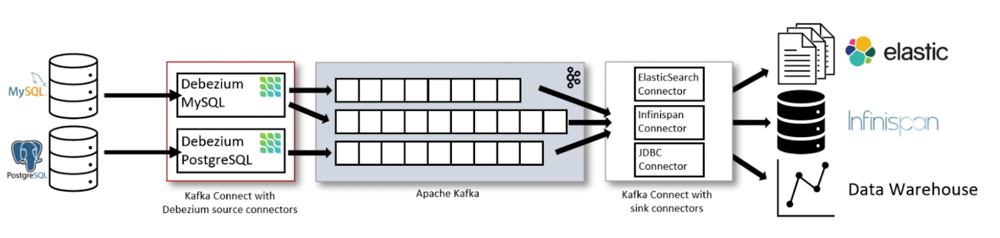

# Implementing MySQL Change Data Capture with Debezium

Before getting into details on how we implement it, let's get into what actually are Change Data Capture and Debezium. If you are just looking for the implementation itself, you can scroll down to the bottom of the page.

## What is Change Data Capture?

Change Data Capture is the process of identifying and capturing changes made to data in a database and then delivering those changes in real-time to a downstream process or system. It's a powerful technique for capturing and consuming continuous movement of data from a database as it occurs. Modern solutions like Debezium leverage native [Write-ahead logging](https://en.wikipedia.org/wiki/Write-ahead_logging) abstractions like MySQL binary logs or Postgres replication slots to get data reliably and fast.

The traditional approach to handle this problem is to batch data from one place to another at regular intervals (e.g., hourly, daily), not in real-time.

## What is Debezium?

Debezium is an open source project that provides a low latency data streaming platform for **Change Data Capture**. It’s designed to monitor upstream databases and produce for each row-level change one or more corresponding events that completely describe those changes. Debezium can stream events (insert, update, delete) of the database after immediate creation.

Some key features Debezium implements:
* **Adaptability:** Debezium works as an interface to many different database management systems, creating a standard to monitor databases. Multiple applications can consume events from it without actually knowing which database architecture is working behind it.
* **Reliability:** Only committed changes are captured, so the applications will not worry about transactions.
* **Fault Tolerance:** Debezium records are durable, so if your application restarts or stops, it will be able to consume all of the events missed while it was not running.

Debezium achieves its **durability**, **reliability**, and **fault tolerance** qualities by reusing [Kafka](https://kafka.apache.org/) and [Kafka Connect](https://docs.confluent.io/platform/current/connect/index.html). Each Debezium connector monitors a single upstream database server, capturing all of the changes and recording them in one or more Kafka topics (typically one topic per database table). 

Kafka ensures that:
* all of these data change events are replicated and totally ordered, delivered in the same order they occurred in the upstream database;
* many clients can independently consume these same data change events with little impact on the upstream system;
* clients can stop consuming at any time, and when they restart they resume exactly where they left off;
* each client can determine whether they want exactly-once or at-least-once delivery.

If you prefer to have the connectors to send changes directly to the application rather than persisting them inside Kafka, you can use [Debezium's embedded connector engine](https://debezium.io/documentation/reference/stable/development/engine.html).

> ☝️ _**What is Kafka Connect?**_
>
> _Kafka Connect is an open-source tool for scalably and reliably streaming data between Kafka and other data systems. It makes it simple to quickly define connectors that move large data sets in and out of Kafka. It can ingest entire databases or collect metrics from all your application servers into Kafka topics, making the data available for stream processing with low latency. An export connector can deliver data from Kafka topics into secondary indexes like Elasticsearch, or into batch systems–such as Hadoop for offline analysis._
> 
> _Kafka Connect works as a centralized data hub and operates as a separate service besides the Kafka broker. Kafka Connect works in both standalone and distributed modes._

Debezium has a few topics in Kafka to handle how it recognizes changes in the database. Both Schema History and Schema Change topics contain the records of all DDL statements along with the position in the binlog where each DDL statement appeared. But they have some differences though:

|   	| Schema History Topic | Schema Change Topic |
|---	|---	|---	|
| Use | For internal use only | For consumer use |
| Naming | Specified in connector config `database.history.kafka.topic` | Uses `database.server.name` |
| Storage | Completely present in Kafka | Schema → Schema Registry. Data → Kafka |

### Common use cases

* **Cache invalidation:** you can create a separate process with a simpler logic to invalidate or update the affected cache entries (e.g., Redis, Memcache, and others).
* **Simplifying monolithic applications:** it enables you to avoid [Dual-Write problems](https://www.confluent.io/blog/dual-write-problem/), that way you can create separate processes to handle cases where you need to write to multiple systems outside of a single transaction, avoid the risks of losing data or spreading data inconsistencies throughout the systems.
* **Sharing databases:** Debezium makes it very straightforward for one application to become aware of the changes committed by another application within one single database. With Debezium each application can monitor the database and react to the changes.
* **Data integration:** ETL-type solutions can be quickly implemented with Debezium specially when data is stored in multiple places.
* **[CQRS (Command Query Responsibility Segregation)](https://martinfowler.com/bliki/CQRS.html):** Debezium captures those changes recorded on the update-side in durable, totally ordered streams that are consumed by the services that asynchronously update the read-only views.

### Thoughts on Debezium, Kafka and optimizations

When using several Debezium connectors in the same Kafka cluster with large tables, it is not uncommon that a given Kafka node runs out of disk space or that the initial Debezium snapshot takes days to finish. Think about optimizing Kafka usage in advance. Here are a few tips I grouped out of [this article](https://medium.com/shippeo-tech-blog/debezium-to-snowflake-lessons-learned-building-data-replication-in-production-a5430a9fe85b).

* **Create Kafka topics manually before initializing Debezium to have control over configuration.** For example, using the retention policy “Compact+Delete” is particularly useful for topics used by Debezium as it allows Kafka to keep only the latest message for a given Kafka Key, which leads to less storage usage.
* **Increase the number of partitions of Kafka topics corresponding to your largest tables.** This will increase the parallelism of write operations in Kafka and massively expedite the initial snapshot of large tables.
* **Use AVRO serialization with a Schema registry instead of the default JSON serialization.** This will reduce the message sizes and save on storage usage.

## Running Debezium and MySQL locally with Docker

I created this project in GitHub [matheusmellolima/debezium-mysql-cdc](https://github.com/matheusmellolima/debezium-mysql-cdc) explaining some steps on how to run Debezium in your machine using Docker.

## References

* [📃 Debezium](https://debezium.io/)
* [📃 Debezium on GitHub](https://github.com/debezium/debezium)
* [📃 Debezium to Snowflake: Lessons learned building data replication in production](https://medium.com/shippeo-tech-blog/debezium-to-snowflake-lessons-learned-building-data-replication-in-production-a5430a9fe85b)
* [▶️ Debezium - Capturing Data the Instant it Happens (with Gunnar Morling)](https://www.youtube.com/watch?v=88j7EEiyqzM)
* [▶️ Change Stream Processing with Debezium and Apache Flink](https://youtu.be/31OrDF0RQgs)